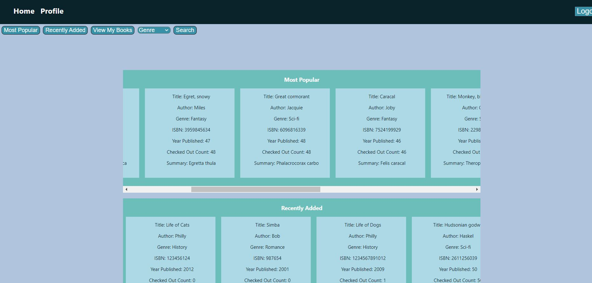
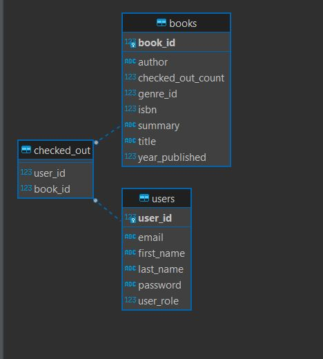

## Virtual Public Library
Virtual library system is virtual library in online. Users can search eBooks in library and checkout their favorite books. And there is a role called owner, who can manage e-book inventory.

# Technologies Used
- Java
- React
- AWS EC2
- Hibernate
- Spring Boot
- Spring Data
- PostgreSQL

## User stories

# As a user, the user can
- Register new account, receive welcome email

- Login/Logout
- View Homepage

- View/Edit user’s information
- Checkout Book 
- View list of previously checked out books
- Search books by title, author, genre, ISBN by using search bar 

# As an owner, the user can
- Login/Logout
- Add new books
- Delete books by ISBN
- Edit uploaded books’ info
- View all registered users’ information

# Getting Started
Setup the database following the below image, frontend folder, and backend folder with AWS RDS, and EC2.

Open the VirtualPublicLibrary folder using Intellij, create file named application.properties into following path: Project1\Project01\app\src\main\resources

Open the vpl-frontend folder using Visual Studio Code

# Testing
- Have over 79% test coverage of service classes

# Future Feathers
- User would recieved a marketing email when new books are uploader
- User would recieved email with temporary password upon registration
- Add wish list for each user
- Owners can view popularity metrics

